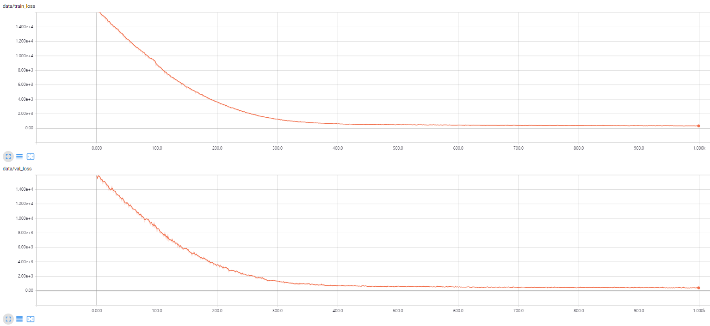
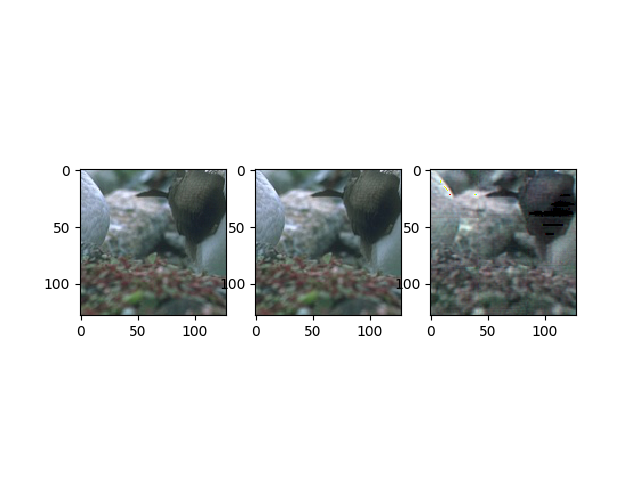
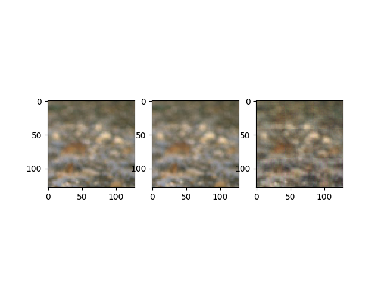
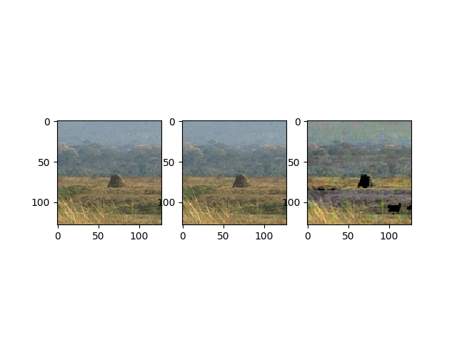
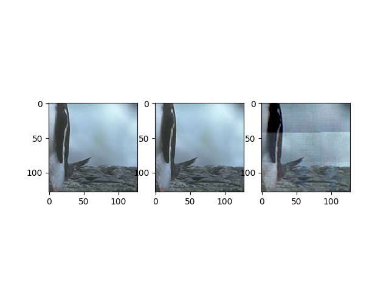

# Convolutional-Denoising-AutoEncoder

```bash
Download

- https://cv.snu.ac.kr/research/VDSR/train_data.zip 
- https://cv.snu.ac.kr/research/VDSR/test_data.zip


Dataset(dir)
  train
    350 Images
  test
    66 Images
```
## lOSS CURVE
Loss curve during training (up : train loss // down : validation loss)


## Training Details
1000 epoch with lr = 0.004 (see Default_option.py for more detail)
Crop the input images into (128 X 128)

## Input / Target(Original) / Output 
Trained and tested with VDSR dataset
There are some blurrings..in the output image





## Limitations
Small number of dataset
